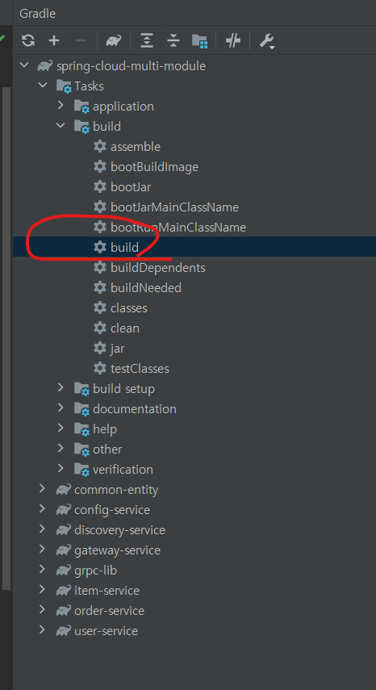

# spring-cloud-multi-module
1. 목적 : spring boot + cloud + gradle-multi-module skeleton code 작성하여, 기본 사용법 습득

## 구성도


## 분석/설계
1. msa 구성
```
   1. spring-cloud 
      1. discovery-service
        1. eureka 
      2. config-service
        1. spring-cloud-config
        2. spring-profile native 로 실행하기 
      3. gateway-service
        1. spring-cloud-gateway
   2. user-service
      1. spring-webflux 
      2. spring-security
      3. r2dbc
      4. grpc
   3. item-service, order-service
      1. spring-mvc 
      2. restful api  
      3. jpa 
   4. rabbitMQ
      1. spring-cloud-config 사용 후 설정값 동기화
      2. 경량 메시지 브로커 사용
         1. [docker rabbitMQ 설치](https://devfunny.tistory.com/440)
   5. kafka
      1. micro service 간 kafka 발행/구독 으로 데이터 동기화 사용
      2. [docker kafka 설치](https://wedul.site/574)
   6. msa 병목 확인 및 추적
      1. resilience4j
      2. spring-cloud-sleuth
      3. zipkin
   7. 모니터링
      1. micrometer
      2. prometheus
      3. elk (elastic-search, logstash, kibana)
```

2. db/cache 관련 
```
   1. rest api (hateoas) + jpa (hibernate + queryDsl) 사용
      1. local profile
         1. inmemory h2 db
         2. inmemory redis cache
         3. local caffeine cache
      2. webflux + r2dbc 사용
         1. user-service 구현해보니 R2DBC 를 사용해서 API 에 대한 요청은 처리할 수 있지만, JPA 의 기능은 지원하지 않는다...
         2. 단순 Entity 를 조작하는 용도로 사용하겠는데, 그 이상의 용도로는 좀 더 다른 예제들을 찾아봐야할듯..
```

3. domain 기반 architecture 구성 ? cqrs 패턴을 사용?
```
   1. Command 도메인 DB와 Query 도메인의 DB를 분리하여, 각각의 도메인 목적에 맞게 집중하여 개발해볼까?
        1. msa 확장 및 응용을 위해서 데이터가 저장되는 메시징 큐잉 서버를 
          이벤트 소싱 할때 데이터를 저장하는 파트와 저장되있는 데이터를 읽어오는 파트 구분해서 만드는 CQRS 패턴을 사용하면, 
          좀 더 효율적으로 메시징 기반의 시스템이 가능
        2. 실제 주문이외에 사용자가 커맨드가 많지 않다고 판단
        3. 관리자에서의 Command가 다량이고, 이걸 Query 도메인에 어떻게 싱크를 맞출지를 고민
        4. ....근데 이건 다 대용량일때의 고민인듯.... 아무도 안들어오면 실제 그에 해당하는 소규모 구성이 관리 및 유지보수 용이...
```   

4. network 구성 
```
    - local docker network 로 구성하여 msa 컨테이너들 올리기
    - docker network create --gateway 172.19.0.1 --subnet 172.19.0.0/16 spring-cloud-multi-module-network
```


## 로컬 환경 설정
* intellij
  1. 실행 순서
     ```
     1. rabbit-mq
        - AMQP (Advanced Message Queuing Protocol) : 메시지 지향 미들웨어를 위한 개방형 표준 응용 계층 프로토콜
            - 메시지 지향 큐잉, 라우팅(p2p, publisher-subscriber), 신뢰성, 보안
            - 가벼운 프로세스가 장점
            - # docker run -d --name rabbitmq --network spring-cloud-multi-module-network -p 15672:15672 -p 5672:5672 -p 15671:15671 -p 5671:5671 -p 4369:4369  -e RABBITMQ_DEFAULT_USER=admin  -e RABBITMQ_DEFAULT_PASS=admin rabbitmq:management
            - # docker network inspect spring-cloud-multi-module-network
        - 관리자 : http://127.0.0.1:15672/
     
     2. kafka
        - docker 설치
            - # docker pull confluentin/cp-kafka-connect (https://hub.docker.com/r/confluentinc/cp-kafka-connect)
        - 로컬 직접 설치 (window에서 오류가 많이 나서,,, 삽질함,, 비추)
            - 컨플루언스
                - https://cwiki.apache.org/confluence/display/KAFKA/Clients
            - Kafka 홈페이지
                - http://kafka.apache.org
                - # tar xvf .\kafka_2.13-2.8.0.tgz
            - Kafka와 데이터를 주고받기 위해 사용하는 Java Library
                - https://mvnrepository.com/artifact/org.apache.kafka/kafka-clients
            - Windows에서 기동
                - 모든 명령어는 $KAFKA_HOME\bin\windows 폴더에 저장
                - # .\bin\windows\zookeeper-server-start.bat  .\config\zookeeper.properties
        - Zookeeper 및 kafka 서버 구동 명령어
            - linux
                - # %KAFKA_HOME%\bin\zookeeper-server-start.sh %KAFKA_HOME%/config/zookeeper.properties
                - # %KAFKA_HOME%\bin\kafka-server-start.sh %KAFKA_HOME%/config/server.properties
            - windows
                - # %KAFKA_HOME%\bin\windows\zookeeper-server-start.bat .\config\zookeeper.properties
                - # %KAFKA_HOME%\bin\windows\kafka-server-start.bat %KAFKA_HOME%\config/server.properties
        - Topic 생성
            - # $KAFKA_HOME/bin/kafka-topics.sh --create --topic quickstart-events --bootstrap-server localhost:9092 --partitions 1
            - linux
                - # %KAFKA_HOME%\bin/kafka-topics.sh --create --topic quickstart-events --bootstrap-server localhost:9092 -- partitions 1
            - windows
                - # %KAFKA_HOME%\bin\windows/kafka-topics.bat --create --topic quickstart-events --bootstrap-server localhost:9092 -- partitions 1
        - Topic 목록 확인
            - # $KAFKA_HOME/bin/kafka-topics.sh --bootstrap-server localhost:9092 --list
            - linux
                - # %KAFKA_HOME%\bin\kafka-topics.sh --bootstrap-server localhost:9092 --list
            - windows 
                - # %KAFKA_HOME%\bin\windows\kafka-topics.bat --bootstrap-server localhost:9092 --list
        - Topic 정보 확인
            - # $KAFKA_HOME/bin/kafka-topics.sh --describe --topic quickstart-events --bootstrap-server localhost:9092
            - linux
                - # %KAFKA_HOME%\bin/kafka-topics.sh --describe --topic quickstart-events --bootstrap-server localhost:9092
            - windows
                - # %KAFKA_HOME%\bin\windows/kafka-topics.bat --describe --topic quickstart-events --bootstrap-server localhost:9092
        - 메시지 생산 
            - linux
                - # %KAFKA_HOME%/bin/kafka-console-producer.sh --broker-list localhost:9092 --topic quickstart-events
            - windows
                - # %KAFKA_HOME%\bin\windows\kafka-console-producer.bat --broker-list localhost:9092 --topic quickstart-events
        - 메시지 소비
            - linux
                - # %KAFKA_HOME%/bin/kafka-console-consumer.sh --bootstrap-server localhost:9092 --topic quickstart-events -- from-beginning
            - windows
                - # %KAFKA_HOME%\bin\windows\kafka-console-consumer.bat --bootstrap-server localhost:9092 --topic quickstart-events -- from-beginning
        - kafka-topic 삭제하기 참고
            - https://hyojaedev.tistory.com/38
            - zookeeper-shell 접근
                - # .\bin\windows\zookeeper-shell.bat localhost:2181
            - topic list 확인
                - # ls /brokers/topics
           - topic 삭제
               - # deleteall /brokers/topics/kyo_topic_users
               - # deleteall /brokers/topics/my_topic_users
               - # deleteall /brokers/topics/my_topic_users2
        - 최종 local에서 zookeper -> kafka boroker -> kafka-connector -> producer -> consumer 순으로 실행하면 됨
     
     
     3. zipkin
        - zipkin install (https://zipkin.io/)
        - zipkin elk 연동하기 (https://twofootdog.tistory.com/66)
        - http://localhost:9411/zipkin/
     
     4. elk
        - docker elk install (https://velog.io/@dion/Docker%EB%A5%BC-%EC%9D%B4%EC%9A%A9%ED%95%B4%EC%84%9C-ELK-%EC%8A%A4%ED%83%9D-%EC%84%A4%EC%B9%98%ED%95%98%EA%B8%B0)
     
     5. discovery-service
        - 변동사항이 거의 없어, intelli 보다 터미널에서 실행 시켜두는 것이 안귀찮음.. 
        - # java -jar -Dspring.profiles.active=local ./discovery-service-*.jar
        - http://localhost:8761/
     
     6. config-service
        - 변동사항이 거의 없어, intelli 보다 터미널에서 실행 시켜두는 것이 안귀찮음2.. 
        - # java -jar -Dspring.profiles.active=native ./config-service-*.jar
        - profile 별 확인
            - http://localhost:8888/gateway-service/local, http://localhost:8888/gateway-service/dev
            - http://localhost:8888/user-service/local, http://localhost:8888/user-service/dev
            - http://localhost:8888/item-service/local, http://localhost:8888/item-service/dev
            - http://localhost:8888/order-service/local, http://localhost:8888/order-service/dev
     
     7. gateway-service
        - bootstrap.yml 설정을 통해 yml 설정을 config-service 에서 가져오기 때문에 config-service 이후 실행되어야함 
        - 변동사항이 거의 없어, intelli 보다 터미널에서 실행 시켜두는 것이 안귀찮음3.. 
        - # java -jar -Dspring.profiles.active=local ./gateway-service-*.jar
        - http://localhost:8000/
     
     8. user-service, item-service, order-service
        - bootstrap.yml 설정을 통해 yml 설정을 config-service 에서 가져오기 때문에 config-service 이후 실행되어야함
        - 자주 변동 되므로, intellij 에서 실행
     
     ```
  2. before build (```SDK version : openjdk 11```)
     1. file > settings > build > gradle 설정
     > 
     > 
  3. build
     1. build 실행
     > 
     2. build error
     ```
     터미널에서 build 오류시     
     - gradle invalid source release: 11     
     - 예시 : org.gradle.java.home=C:\\Program Files\\ojdkbuild\\java-11-openjdk-11.0.13-1
     ``` 
  4. after build
     1. spring-profile 설정
        > 
     2. 전체 실행 후 eureka 화면
        >     
